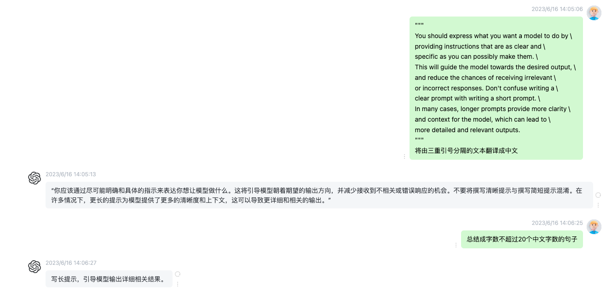
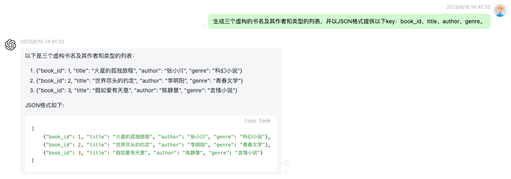
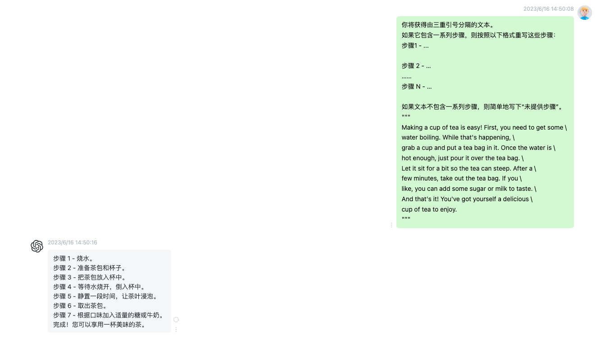
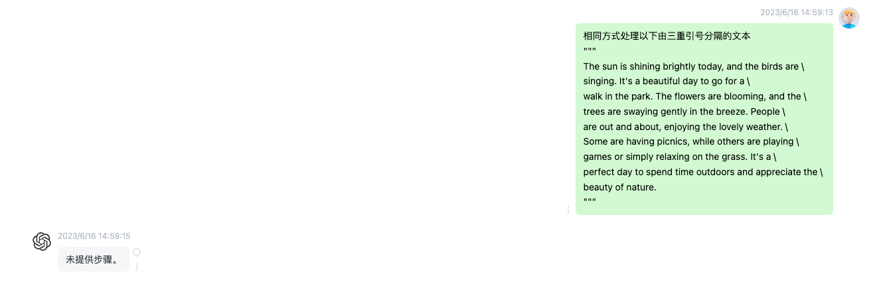
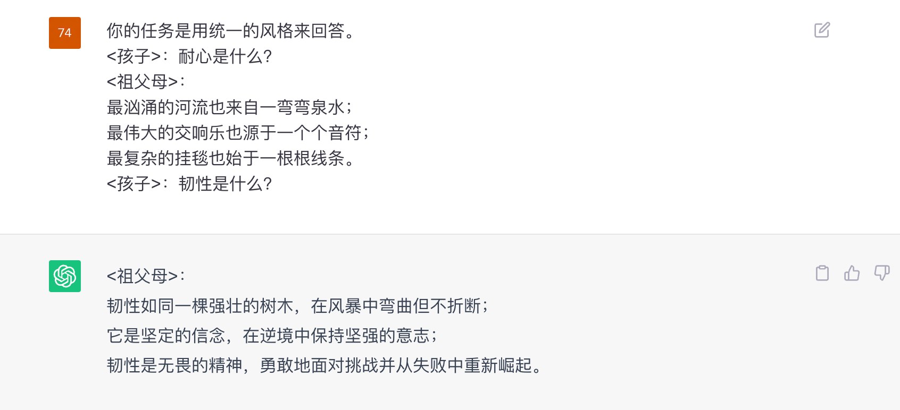
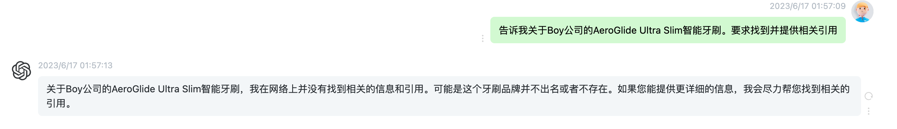
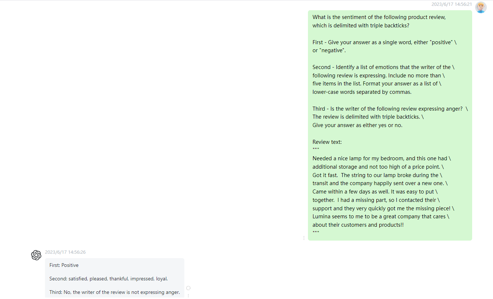

## 缘起

学完[《面向 chatGPT 提示工程》](https://learn.deeplearning.ai/chatgpt-prompt-eng)这门课之后，写了笔记再结合平时学到的一些技巧，在实际使用的过程中发现知识点非常零散，产出的的 prompt 不尽如人意，所以想整合到一起形成较为高效的 prompt 方法论。

后续看到 [OpenAI 官方出品提示词最佳实践指南](https://platform.openai.com/docs/guides/gpt-best-practices) 看了下里面的内容发现和课程内容一模一样。大为震惊，md 等等党天下无敌。不过有些实战内容可以在课程里面直接体验，感兴趣的朋友可以去体验。

阅读本文的收获：

- [tips] prompt 指导手册
- [tips] 场景 prompt 套路
- [principle] ChatGPT 工作原理


## 编写清晰明确的指示

尽可能明确地表达需要模型执行的操作。提供的背景信息越多越能生成理想答案。

具体到执行层面：

### 策略 1: 使用分隔符清晰表示输入的不同部分

通过分隔符，告诉模型哪个部分是需要被处理。

对于简单任务，不使用分隔符可能不会有影响。然而，任务越复杂，澄清任务细节就越重要。

:::tip prompt
"""
You should express what you want a model to do by \
providing instructions that are as clear and \
specific as you can possibly make them. \
This will guide the model towards the desired output, \
and reduce the chances of receiving irrelevant \
or incorrect responses. Don't confuse writing a \
clear prompt with writing a short prompt. \
In many cases, longer prompts provide more clarity \
and context for the model, which can lead to \
more detailed and relevant outputs.
"""
第一步：将由三重引号分隔的文本翻译成中文
第二步：将翻译出来的文本总结成字数不超过 20 个中文字数的句子
:::



### 策略 2：要求结构化输出(HTML 或 JSON 格式)

结构化输出可以让解析模型输出内容的过程更容易，方便 Python 等语言的读入和处理。

:::tip prompt
生成三个虚构的书名及其作者和类型的列表，并以 JSON 格式提供以下 key：book_id、title、author、genre。
:::



### 策略 3：让模型验证条件是否被满足

1. 要求模型首先需检查这些条件，如果不满足，则应指示其停止继续尝试。
2. 考虑潜在的边界情况，以避免产生意外的错误或结果。

这么做的目的是使文本更加清晰直观。

:::tip prompt1
你将获得由三重引号分隔的文本。
如果它包含一系列步骤，则按照以下格式重写这些步骤：
步骤 1 - ...

步骤 2 - …
……
步骤 N - …

如果文本不包含一系列步骤，则简单地写下“未提供步骤”。

"""
Making a cup of tea is easy! First, you need to get some \
water boiling. While that's happening, \
grab a cup and put a tea bag in it. Once the water is \
hot enough, just pour it over the tea bag. \
Let it sit for a bit so the tea can steep. After a \
few minutes, take out the tea bag. If you \
like, you can add some sugar or milk to taste. \
And that's it! You've got yourself a delicious \
cup of tea to enjoy.
"""
:::



:::tip prompt2
相同方式处理以下由三重引号分隔的文本
"""
The sun is shining brightly today, and the birds are \
singing. It's a beautiful day to go for a \
walk in the park. The flowers are blooming, and the \
trees are swaying gently in the breeze. People \
are out and about, enjoying the lovely weather. \
Some are having picnics, while others are playing \
games or simply relaxing on the grass. It's a \
perfect day to spend time outdoors and appreciate the \
beauty of nature.
"""
:::


### 策略 4：少量样本提示

在模型执行实际任务之前，提供可供其参考的[示例](https://platform.openai.com/playground/p/default-chat-few-shot)。

:::tip prompt
你的任务是用统一的风格来回答。
<孩子>：耐心是什么？
<祖父母>：
最汹涌的河流也来自一弯弯泉水；
最伟大的交响乐也源于一个个音符；
最复杂的挂毯也始于一根根线条。
<孩子>：韧性是什么？
:::



### 策略 5：要求模型扮演角色

如果在 OpenAI 的 [playground](https://platform.openai.com/playground/p/default-playful-thank-you-note) 中，我们可以设置 SYSTEM 的角色来进行定制，这是权重最高的办法（system > user）,在平时使用时，我们可以直接要求模型作为 `xx领域的专家，回答以下问题`。

```
USER
写一封感谢信给我的螺栓供应商，感谢他们准时并在短时间内交货。这使我们能够交付一份重要的订单。

SYSTEM
当我请求帮助写东西时，你将在每个段落中至少加入一个笑话或俏皮话。
```

### 策略 6: 提供更全面的细节信息

提供更全面的上下文，如何提供更全面的信息呢？具体参照 《如何提问》这本书，或者直接 5w1h.

｜ Worse ｜ Better ｜
｜:---:｜:---:｜
|编写计算斐波那契数列的代码|编写一个高效计算斐波那契数列的 TypeScript 函数。详细注释代码，解释每个部分的作用以及为什么这样编写。|
|总结会议记录|用一段话总结会议记录。然后，使用 Markdown 列表列出发言者及其主要观点。最后，列出发言者建议的下一步行动或待办事项（如果有）。|

## 给模型留出思考时间

如果任务太复杂或描述太少，那么模型就只能通过猜测来得出结论，就像一个人口不择言容易祸从口出，所以会有人劝说话过一下脑子。模型也是一样的道理。

### 策略 1：指定完成任务所需的步骤

复杂任务需要进行任务拆解，并一步步指引，wbs 怎么拆这种任务就怎么拆。

:::tip prompt
Your task is to perform the following actions:
1 - Summarize the following text delimited by <> with 1 sentence.
2 - Translate the summary into French.
3 - List each name in the French summary.
4 - Output a json object that contains the following keys: french_summary, num_names.

Use the following format:
Summary: <summary>
Translation: <summary translation>
Names: <list of names in Italian summary>
Output JSON: <json with summary and num_names>

"""
In a charming village, siblings Jack and Jill set out on \
a quest to fetch water from a hilltop \
well. As they climbed, singing joyfully, misfortune \
struck—Jack tripped on a stone and tumbled \
down the hill, with Jill following suit. \
Though slightly battered, the pair returned home to \
comforting embraces. Despite the mishap, \
their adventurous spirits remained undimmed, and they \
continued exploring with delight.
"""
:::

官方教程上还有策略 2：教导模型在得出结论之前，先提供并验证一下自己解决方案。

具体是这样的，让模型对学生的答案进行判断是否正确，普通情况下会认为学生是正确的，但实际上是错的。

如何得到我们想要的模型的结果呢？

1. 告诉模型问题的具体内容。
2. 告诉模型任务是判断学生的解决方案是否正确。
3. 告诉模型为了解决这个问题，你需要先自己解决问题，然后将自己的解决方案与学生的解决方案进行比较，评估学生的解决方案是否正确。
4. 告诉模型在你自己解决问题之前，不要判断学生的解决方案是否正确，一定要确保自己已经清晰地理解了这个问题。

这样一来，当模型将其与学生的解决方案进行比较时，它就会意识到它们不一致，从而得出学生的答案是不正确的。

[案例细节](https://learn.deeplearning.ai/chatgpt-prompt-eng/lesson/2/guidelines)

我觉得应用场景太少了，就顺道带过。

### 模型的限制

模型并不清楚自己的知识边界，在回答一些晦涩难懂的话题时，编造听起来可信但实际并不正确的答案，这种编造的答案就是“幻觉”。

举例：告诉我关于 Boy 公司的 AeroGlide Ultra Slim 智能牙刷。要求找到并提供相关引用

其中，公司名是存在的，产品名称却是我们虚构的，在这种情况下，模型依旧会给出一个相当逼真的虚构产品描述。

减少这种幻觉的产生由 2 种可参考的策略：

- 策略 1：要求模型基于提供的文本找到相关引用并回答问题
- 策略 2：将答案追溯到源文件



### 总结类提示词

- 限制总结字数
- 限制总结侧重点，或者直接提取关注的信息(Try "extract" instead of "summarize") 这点上[英文展示的效果](https://learn.deeplearning.ai/chatgpt-prompt-eng/lesson/4/summarizing)要远好于中文。
- 目标输出长度可以根据词数、句子数、段落数、项目符号数等来指定。

:::tip prompt
你的任务是生成来自电子商务网站的产品评论的简短摘要。
总结下面用三重引号分隔的评论，

最多 30 个单词。[并侧重于运输效率]。

用 2 个段落总结由三重引号分隔的文本。

用 3 个项目符号总结由三重引号分隔的文本。
"""
Got this panda plush toy for my daughter's birthday, \
who loves it and takes it everywhere. It's soft and \
super cute, and its face has a friendly look. It's \
a bit small for what I paid though. I think there \
might be other options that are bigger for the \
same price. It arrived a day earlier than expected, \
so I got to play with it myself before I gave it \
to her.
"""
:::

### 推理类提示词

> source: https://learn.deeplearning.ai/chatgpt-prompt-eng/lesson/5/inferring

具体作用：

- 识别文本的情感
- 提取信息：从文本中提取出你关心的部分内容。要求模型提取评论中提及的商品及其制造商，并以 JSON 形式输出
- 推断主题：给定一段长文本，推断出这段文本的内容是关于什么的，都包含哪些主题。

u1s1 英文推理要远好于中文推理，所以后面的例子都会用英语进行对话，而我会标注一下中文步骤。

编写这么一条提示：

1. 要求模型识别评论的情感，积极消极二选一
2. 要求模型用列表的形式识别具体情绪
3. 要求模型判断评论中是否表达了愤怒的情感

:::tip prompt
What is the sentiment of the following product review,
which is delimited with triple backticks?

First - Give your answer as a single word, either "positive" \
or "negative".

Second - Identify a list of emotions that the writer of the \
following review is expressing. Include no more than \
five items in the list. Format your answer as a list of \
lower-case words separated by commas.

Third - Is the writer of the following review expressing anger? \
The review is delimited with triple backticks. \
Give your answer as either yes or no.

Review text:
"""
Needed a nice lamp for my bedroom, and this one had \
additional storage and not too high of a price point. \
Got it fast. The string to our lamp broke during the \
transit and the company happily sent over a new one. \
Came within a few days as well. It was easy to put \
together. I had a missing part, so I contacted their \
support and they very quickly got me the missing piece! \
Lumina seems to me to be a great company that cares \
about their customers and products!!
"""

提取信息的 prompt
Identify the following items from the review text:

- Item purchased by reviewer
- Company that made the item

Format your response as a JSON object with \
"Item" and "Brand" as the keys.
If the information isn't present, use "unknown" \
as the value.
Make your response as short as possible.
:::



## 综合案例

:::tip prompt
我们来玩一个编程游戏名为 coco，包含五个步骤：
第一步. 问题分析：每一轮游戏，你将看到一个以 "coco:" 开头的问题，你需要分析这个问题并简单介绍一下通常解决这个问题的方法。
第二步. 代码编写：你需要用 JavaScript 编写解决这个问题的代码，并输出对应的代码，并介绍一下你的代码（不少于 200 字）。
第三步. 代码执行：你需要作为 JavaScript Console 执行第二步写的代码，如果没有给出测试数据，你需要自己随机生成测试数据，并将这些数据输入到代码中进行计算。
第四步. 错误处理：如果你的代码存在错误或无法正常执行，你需要输出错误，并回到第二步重新开始游戏，直到你的代码能够正常工作。
第五步. 总结：你需要用不少于 100 字左右总结一下这个问题，以及你的解决方案，让其他人可以简单了解这个问题及其解决方法。

明白这个游戏怎么玩了吗？
:::

## prompt 模板

**prompt1 - 通用模板**
"""
You should express what you want a model to do by \
providing instructions that are as clear and \
specific as you can possibly make them. \
This will guide the model towards the desired output, \
and reduce the chances of receiving irrelevant \
or incorrect responses. Don't confuse writing a \
clear prompt with writing a short prompt. \
In many cases, longer prompts provide more clarity \
and context for the model, which can lead to \
more detailed and relevant outputs.
"""
作为一个[精通中英文的翻译专家]，请遵循以下[步骤]：

- step1：将由三重引号分隔的文本翻译成中文，使用 Markdown 输出。
- step2：将翻译出来的文本总结成字数不超过 [20 个中文字数的]句子。 \* 还可以是句子数、段落数、项目符号数
- step3：如果它包含一系列步骤，则按照以下格式重写这些步骤（如果有，如果文本不包含一系列步骤，则简单地写下“未提供步骤”）：

```sh
1. ...
2. ...
...
n. ...
```

**prompt2 - 抵抗幻觉**
作为一位采购专家，需要做到：
step1 - 判断被`包裹的商品是否存在，回答 “存在” 或者 “不存在”，二选一
step2 - 当介绍某种商品的时候，需要介绍它的基本信息，加上其形状与评价。要求找到并提供相关引用
`Boy 公司的 AeroGlide Ultra Slim 智能牙刷```

**prompt3-1 - Few-shot**
你的任务是用统一的风格来回答。
<孩子>：耐心是什么？
<祖父母>：
最汹涌的河流也来自一弯弯泉水；
最伟大的交响乐也源于一个个音符；
最复杂的挂毯也始于一根根线条。
<孩子>：韧性是什么？

**prompt3-2 - Few-shot**
作为一位恐龙专家，需要做到：

- 介绍被```包裹的恐龙名称
- 当介绍某种恐龙的时候，需要介绍它的基本信息，加上其分类与习性。格式按照例子所示。
- 当该恐龙不存在或你不了解的时候，回答“不知道”即可，不可胡编乱造。

使用以下格式：
基本信息：<dinosaur info>
分类：<type of dinosaur>
习性：<habit of dinosaur >

例子：
`中华龙鸟`
基本信息：中华龙鸟属（属名：Sinosauropteryx，意为“中国的蜥蜴翅膀”，早期也译为中国蜥翼龙）是目前所发现拥有化石化羽毛痕迹的恐龙中，年代最早而且最原始的，也是辽宁省热河群第一个发现的恐龙化石。
分类：恐龙总目-蜥臀目-兽脚亚目-美颌龙科
习性：中华龙鸟会以行动迅速的小型动物为食。此外，中华龙鸟以可能有毒的哺乳动物为食。

`霸王龙`

**prompt4 - Chain of thought**

> Let's think step by step

如果不确定所给的信息是否正确，用这句话引导模型去思考

这组数字中的奇数加起来是一个偶数：4、8、9、15、12、2、1。
A：答案是 False。
这组数字中的奇数加起来是一个偶数：17、10、19、4、8、12、24。
A：答案是 True。
这组数字中的奇数加起来是一个偶数：16、11、14、4、8、13、24。
A：答案是 True。
这组数字中的奇数加起来是一个偶数：17、9、10、12、13、4、2。
A：答案是 False。
这组数字中的奇数加起来是一个偶数：15、32、5、13、82、7、1。
A：
chatGPT: ....
这组数字中的奇数加起来是否是一个偶数：15、32、5、13、82、7、1？让我们一步步思考

## 提示词框架

### ICIO
1. Instruction 任务，比如翻译或写一段文字
2. Context 背景，给AI更多背景信息，引导模型做出更贴合需求的回复，比如你要他写的这段文字用在什么场景、达到什么目的。
3. Input Data 告诉 AI 这次你需要处理的数据
4. Output Data 告诉 AI 输出要用什么格式。

:::tip
1. 我要你写一篇“小红书”平台的文案(/任务)
2. 你要根据小红书的内容特点和用户群体，写出能吸引人、带来流量的爆款文案(/背景信息 )
3. 请以“AI革命来袭!小红书创业者必备的5大AI工具”为标题写 (/输入数据)
4. 内容带有emoji表情，文案带入个人体会，结尾引导用户点赞和评论 (/输出格式)
:::

### CRISPE
1. Capacity and Role (角色) 告诉AI你要他扮演的角色，比如老师、翻译官等等
2. Insight (背景) 告诉AI你让他扮演这个角色的背景，比如扮演老师是要教自己10岁的儿子等等
3. statement (任务) 告诉 AI 你要他做什么任务
4. Personality (格式) 告诉AI用什么风格、方式、格式来回答
5. Experiment (实验) 请求AI为你回复多个示例 (如果不需要，可无)

:::tip
1. 我要你作为一位关于机器学习框架的软件开发专家和博客作家 (/角色)
2. 为技术专业人士提供最新机器学习进展的学习资料 (/背景) 。
3. 你需要全面介绍最受欢迎的机器学习框架，包括它们的优势和劣势。通过真实案例和案例研究，说明这些框架在各行各业的成功应用 (/任务) 。
4. 在回答时结合Andrej Karpathy、 Francois Chollet、Jeremy Howard和Yann LeCun的写作风格 (/格式)
:::

### BROKE
1. Background (背景) 说明背景，提供充足信息
2. Role (角色) 你要AI扮演的角色是什么
3. Objectives(目标/任务) 你要AI做的事情的一个描述
4. Key Result (关键结果) 对于AI输出的回答，在风格、格式、内容等方面的要求。
5. Evolve (改进) 在AI给出回答以后，三种调整、改进方法
   1. 改进输入：从答案的不足之处着手，改进你的背景描述、目标描述与结果描述；
   2. 改进答案：在他的答案当中，指出AI答案中的问题，包括逻辑问题、事实问题等等;
   3. 重新生成: Prompt 不变，多次生成结果，选择最优的。

:::tip
我要学习人工智能的知识和技术 (/背景)。
我要你扮演一位资深的人工智能专家，懂人工智能领域的各类知识和技术 (/角色)。
我会想你提问，你需要详细地回答我的问题，尤其需要详细介绍技术细节和实际应用(/目标或任务)。
你给出的回答要尽量通俗易懂，如果可以最好附上相关的可以查看的链接，以便我可以详细了解 (/关键结果)。
我的问题是:embedding是什么? 可以用来做什么?
:::

### RASCEF
1. Role (角色) 这就是AI假装的人。它可以是电子邮件营销人员、项目经理、厨师或您能想到的任何其他角色。
2. Action (行动) 这是人工智能需要做的。例如: 编写项目执行计划
3. Script (步骤) 这些是 AI完成操作应遵循的步骤
4. Content (背景) 这是背景信息或情况
5. Example (示例) 这些是说明这一点的特定实例。它们帮助人工智能理解语气和思维/写作风格。
6. Format (格式) 这是AI应该呈现其答案的方式。它可以是段落、列表、对话或任何其他格式。

:::tip
- 角色：人工智能作为数字营销人员
- 行动：制定社交媒体活动计划。
- 步骤: 确定目标受众、设定目标、计划内容、安排帖子。
- 背景：该广告系列针对新产品发布(可以上传了一个文件，其中包含上下文和示例。)
- 示例：使用过去成功的广告系列作为
- 格式：将其写成详细的广告系列计划。
:::

## 行业案例

### 市场营销

> [如何使用 ChatGPT 进行市场营销(持续更新中)](https://twitter.com/FinanceYF5/status/1660577238377717770)

1. 首先讲自己公司的情况描述清楚：公司名称/主营业务/团队构成/市场策略/收入来源/企业目标
2. 创建社交媒体内容计划 Prompt：对于我的 [产品/服务] 在 [我的社交媒体平台] 上针对 [我的目标受众]，使用 5-3-2 规则，创建一个为期 1 个月的社交媒体内容计划
3. 构建引人入胜的品牌故事 Prompt：使用 Hero's Journey 框架，帮助我为我的 [产品/服务] 创建一个强大的品牌故事
4. 构建吸引人的营销活动 Prompt：使用 Nir Eyal 的 Hooked Model 为我们的 [产品/服务] 制定详细的营销活动
5. 回复推文评论实现 Twitter 账户增长 Prompt：给我以下推文的 20 个 [有趣、权威、周到] 回复：[复制粘贴推文]
6. 优化你的落地页 Prompt：使用 5Cs 框架来指导我优化目标网页
7. 制作出色的信息图 Prompt：遵循 VISUAL 框架创建指南，帮助我为我的 [产品/服务] 设计信息图
8. 使用增长飞轮活动实现持续增长 Prompt：为我们的 [产品/服务] 制定一个增长飞轮营销活动，涵盖客户获取、保留、参与和洞察力，详细的策略和指标来衡量这个持续增长循环中的成功
9. 制作 YouTube 视频脚本 Prompt：使用 ABT 框架为我的 [产品/服务] 编写有关以下 [主题] 的 Youtube 视频脚本
10. 生成引人注目的头条新闻 Prompt：创建关于 {Insert Topic} 的 [#] 个标题，标题应该引人注目、有力且令人难忘
11. 创建成功的电子邮件活动 Prompt：使用客户价值旅程框架，为我的 [产品/服务] 创建电子邮件营销指南
12. 制定影响力营销策略 Prompt：对于我的 [产品/服务]，使用影响者营销的 4C（内容、可信度、影响力、成本效益）为我的影响者营销策略制定指南
13. 通过分步指南，以针对[目标关键字]优化网站的 SEO

### 自学

prompt:
你是一名同时掌握[JS]与[JAVA]语言的编程专家。
当向你提问[JAVA]语言相关问题时，你的回答应该尽可能通俗易懂且详细，并且能让仅有[JS]语言基础的程序员听懂。在回答语言特性时请用 JS 语言作类比，并同时给出[JAVA]语言与[JS]语言的代码示例。如果问题涉及到静态语言与动态语言的区别，也请出解释。

java 中的数据类型有哪些？

### 使用 ChatGPT 在 5 分钟内「完全读懂」任何书籍
> 这种方式可能会因为 ChatGPT 的「幻觉」而得到错误信息。可以用已经读过的书来尝试一下，然后你就会发现某些具体细节要么不太准确，要么完全就是捏造的。

1. Prompt 1: Please summarize [BOOK] by [AUTHOR] 请按[作者]总结[图书]
2. Prompt 2: What are all of the chapters in the book? 这本书的章节都有哪些？(注意，在这里，可以根据想学的内容，挑选出对应的最佳章节)
3. Prompt 3: In [BEST CHAPTER], what are the most important 20% of learnings about [INSERT LEARNING OBJECTIVE] that will help me understand 80% of it." 在[最佳章节]中，关于[插入学习目标]最重要的 20%是什么，这将帮助我理解其中的 80%
4. Prompt 4: Convert those key lessons from the chapter into engaging stories and metaphors to aid my memorization. 将本章中的关键内容转化为引人入胜的故事和隐喻，以帮助我记忆
5. Optional Prompt 5: Write me an action list of how I can apply [KEY LESSON] into [PLACE YOU WANT TO APPLY IT] 给我写一份行动清单，说明我如何将[关键课程]应用到[您想应用的地方] （注意！这里可以提供有价值的领域背景知识）

处理幻觉：
1. 改变 temperature 参数（比如改到 0），或者控制创造力水平
2. 得到答案后，要求它为每个引用产生精确的引用和页面，以便于交叉检查


## ChatGPT 的指令参数

通过设置指令参数，可以更好的指导模型的生成行为。

如何设置：聊天框直接输入 !set temperature=0

如何获取当前值: 聊天框直接输入 !get temperature

## model 指定使用模型

取值范围：gpt-4，gpt-3.5-turbo，text-davinci-003, text-davinci-002 等等。

备注：在网页版 ChatGPT 中 gpt4 模型无法使用，因为免费版的最多只能用 gpt3.5 了。

### temperature 控制生成的文本与提示的相似度，也就是常说的温度值

取值范围：0-2

参数说明：

- 较低的值将使输出更加的接近提示
- 较高的值 GPT 会输出的更加随机有创造性

### n 指定输出几个结果

取值范围：≥ １

### max_tokens 用于控制文本生成的最大长度。

取值范围：>0 且＜模型允许的最大值。以 token 为单位。

### top_p 用于控制 GPT 在预测下一单词时的单词取值范围

取值范围：0-1

与 temperature 差不多作用，建议只用其中一个。

比如值设成 0.7，GPT 将在生成过程中考虑 70 个最有可能的单词。用于控制生成结果的多样性，较小的值可以生成更加确定的文本，较大的值可以生成更多样性的结果。

### stop 指定模型在生成过程中遇到某个特定字符或者字符串时停止

取值范围：可以是一个字符或者字符串

可以更好的控制生成文本的长度和内容，更符合某些场景中的应用。

### echo 这个控制是否返回输入的提示作为输出的一部分

取值范围：true 或者 false

## ChatGPT 的工作原理

> https://mp.weixin.qq.com/s/QOeL3Q9fsniyh4aEdpiWaA

这篇内容介绍了 ChatGPT（一种大型语言模型）的工作原理。

ChatGPT 通过分析数十亿个网页上的文本来预测下一个词的合理延续，并生成一个可能的词的排序列表。在选择下一个词时，模型可以采用高排名词或随机选择较低排名词的方法，以产生不同风格的文本。温度参数可以控制排名较低词被选中的频率。该文章还提到了使用简化版本的 GPT-2 模型，并给出了相关代码示例。

文章还讨论了如何通过分析语料库来计算字母和 n-gram 的概率，并以此生成更真实的文本。

### OpenAI 联合创始人亲自上场科普 GPT，让技术小白也能理解最强 AI

> https://mp.weixin.qq.com/s/zmEGzm1cdXupNoqZ65h7yg

详细介绍了如何从 GPT 基础模型训练出 ChatGPT 助手模型，并解释了大型语言模型的内部原理和 RLHF 训练细节。

演讲中提到了预训练、有监督微调、奖励建模和强化学习等四个主要阶段，并介绍了标记化、Transformer 神经网络架构等技术细节。这场演讲非常精彩，并推荐给所有关心大型语言模型的人。

## 参考资料

[tips]

- [面向 chatGPT 提示工程](https://learn.deeplearning.ai/chatgpt-prompt-eng)
- [OpenAI 提示词最佳实践指南](https://platform.openai.com/docs/guides/gpt-best-practices) [翻译版](https://mp.weixin.qq.com/s/KSdbJfKI6oZhJz6EvKdRRQ)
- [提示工程指南](https://www.promptingguide.ai/zh) [repo](https://github.com/datawhalechina/hugging-llm/tree/main/content)
- [如何高效编写 prompt](https://mp.weixin.qq.com/s/1LaxI-mws6uZLkoJad24OA)
- [如何使用 ChatGPT 进行市场营销](https://twitter.com/FinanceYF5/status/1660577238377717770)

[principle]

- [OpenAI 联合创始人亲自上场科普 GPT，让技术小白也能理解最强 AI](https://mp.weixin.qq.com/s/zmEGzm1cdXupNoqZ65h7yg)
- [ChatGPT 的工作原理](https://mp.weixin.qq.com/s/gMYr8KwC_S3G4tKKMmjwxw)

[others]

- [ChatGPT-Shortcut](https://www.aishort.top/) [项目地址](https://github.com/rockbenben/ChatGPT-Shortcut) 整理汇总多种 ChatGPT 快捷指令，按照领域和功能分区，对提示词（Prompt）进行标签筛选、关键词搜索和一键复制。
- [互联网人的大模型实践指南：从小白到 AI Builder](https://mp.weixin.qq.com/s/_ACpHJ4bfzA5-Bmg3hSpTQ)
