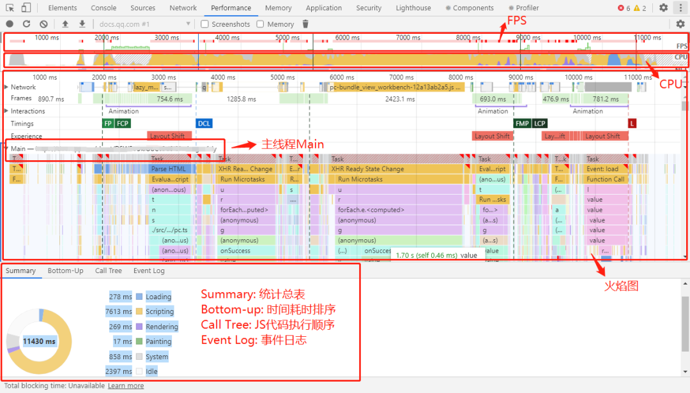

## 查看 placeholder 样式
1. 打开控制台，点击右上角三个点，选择 `more tools` 再选择settings
2. 勾选 show user agent shadow dom

## 利用 Performance 检查运行时性能
1. 在隐身模式下打开 Chrome。隐身模式可确保 Chrome 以干净状态运行，尽量避免例如浏览器的扩展可能会在性能评估中产生的影响。
1. 打开开发者工具，点击 `Performance` 标签
2. 点击左上角的 Record 按钮开始记录，然后你模拟正常用户使用网页。测试完毕后，点击 Stop。
3. 可以看到右上角分别有 FPS、CPU、NET、HEAP：
| name  |          func          |
| :---: | :--------------------: |
|  FPS  |        红差绿优        |
|  CPU  | 各种色块，占比高时间多 |
| HEAP  |       堆内存占用       |

4. 查看 Buttom-up：此视图可以看到某些函数对性能影响最大，并能够检查这些函数的调用路径
5. 查看 火焰图：火焰图直观地表示出了内部的 CPU 分析，横轴是时间，纵轴是调用指针，调用栈最顶端的函数在最下方。启用 JS 分析器后，火焰图会显示调用的每个 JavaScript 函数，可用于分析具体函数

### Performance Monitor
打开 Chrome 控制台后，按组合键 ctrl+p(Mac 快捷键为 command+p)，输入 >ShowPerformanceMonitor，就可以打开 Performance Monitor 性能监视器。主要的监控指标包括：

- CPU usage：CPU 占用率
- JS head size：JS 内存使用大小
- JS event listeners：事件监听数
- DOM Nodes：内存中挂载的 DOM 节点个数

## Rendering 实时检测网页变化
1. 打开开发者工具，点击 Console 标签，按 ESC 弹出
2. 点击左边竖形排列的三个小点，选择 Rendering。下面是比较实用的功能：
   1. Paint flashing，实时高亮重绘区域（绿色）。
   2. Layout Shift Regions，实时高亮重排（重新布局）区域（蓝色）。
   3. Layer borders，将合成层用边框标出来（橙色、橄榄色、青色）。

