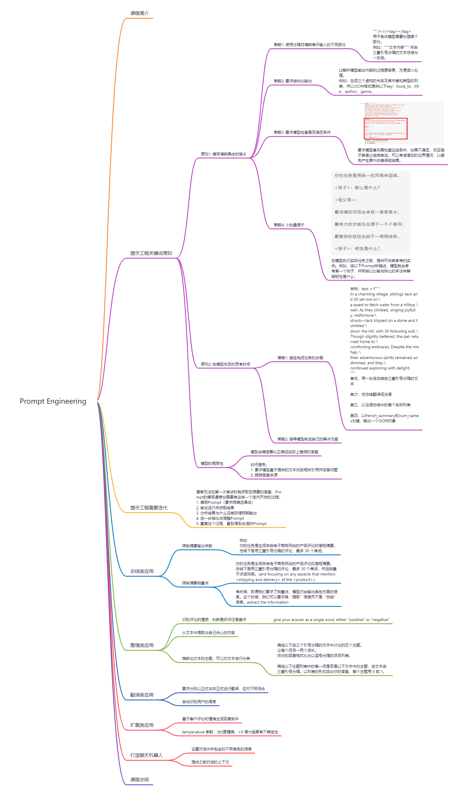

## 【ChatGPT】ChatGPT-Shortcut
> https://newzone.top/chatgpt
>
> 项目地址: https://github.com/rockbenben/ChatGPT-Shortcut

众所周知，我们可以通过优化提示词，使 ChatGPT 生成更加准确、有用的回复。

该项目就整理汇总了多种 ChatGPT 快捷指令，按照领域和功能分区，对提示词（Prompt）进行标签筛选、关键词搜索和一键复制。

## 【ChatGPT】《面向开发者的ChatGPT提示工程》笔记

## 【ChatGPT】如何使用 ChatGPT 进行市场营销
> https://twitter.com/FinanceYF5/status/1660577238377717770

1. 创建社交媒体内容计划 Prompt：对于我的 [产品/服务] 在 [我的社交媒体平台] 上针对 [我的目标受众]，使用 5-3-2 规则，创建一个为期 1 个月的社交媒体内容计划

2. 构建引人入胜的品牌故事 Prompt：使用 Hero's Journey 框架，帮助我为我的 [产品/服务] 创建一个强大的品牌故事

3. 构建吸引人的营销活动 Prompt：使用 Nir Eyal 的 Hooked Model 为我们的 [产品/服务] 制定详细的营销活动

4. 回复推文评论实现Twitter账户增长 Prompt：给我以下推文的 20 个 [有趣、权威、周到] 回复：[复制粘贴推文]

5. 优化你的落地页 Prompt：使用 5Cs 框架来指导我优化目标网页

6. 制作出色的信息图 Prompt：遵循 VISUAL 框架创建指南，帮助我为我的 [产品/服务] 设计信息图

7. 使用增长飞轮活动实现持续增长 Prompt：为我们的 [产品/服务] 制定一个增长飞轮营销活动，涵盖客户获取、保留、参与和洞察力，详细的策略和指标来衡量这个持续增长循环中的成功

8. 制作YouTube视频脚本 Prompt：使用 ABT 框架为我的 [产品/服务] 编写有关以下 [主题] 的 Youtube 视频脚本

9.  生成引人注目的头条新闻 Prompt：创建关于 {Insert Topic} 的 [#] 个标题，标题应该引人注目、有力且令人难忘

10. 创建成功的电子邮件活动 Prompt：使用客户价值旅程框架，为我的 [产品/服务] 创建电子邮件营销指南

11. 制定影响力营销策略 Prompt：对于我的 [产品/服务]，使用影响者营销的 4C（内容、可信度、影响力、成本效益）为我的影响者营销策略制定指南

